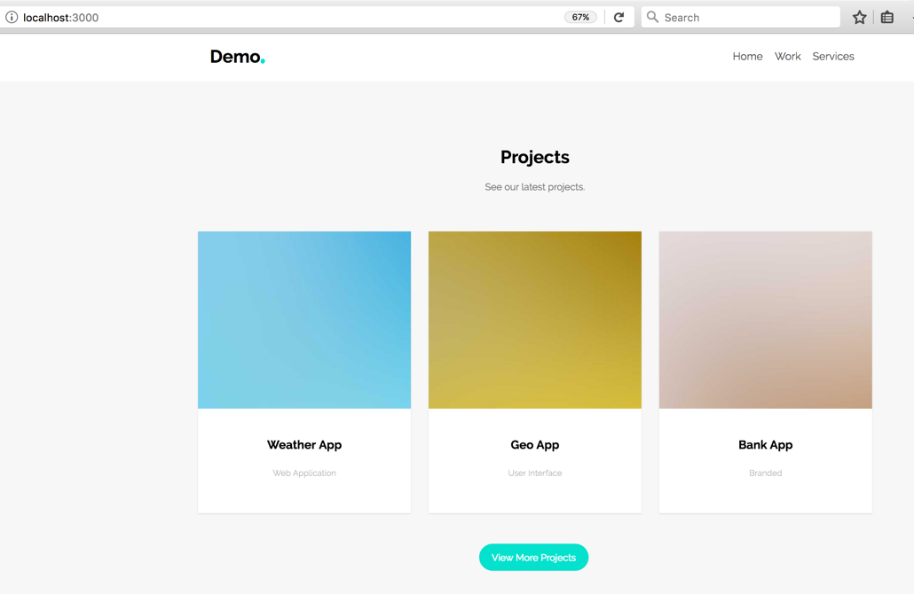

# reactDemos

## Build a a simple webpage with React 



## Prerequisites:

- node (https://nodejs.org/es/download/package-manager/)
- webpack (https://webpack.js.org/guides/installation/) 

## How to use
```
npm install
webpack
nodemon
```
